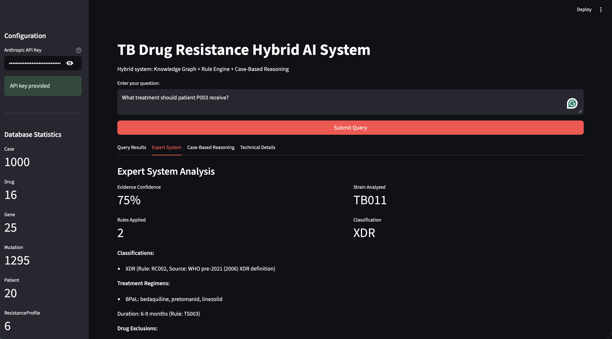
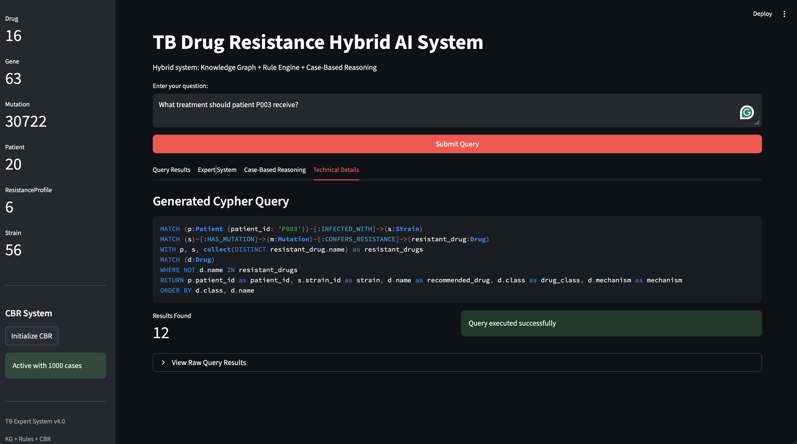
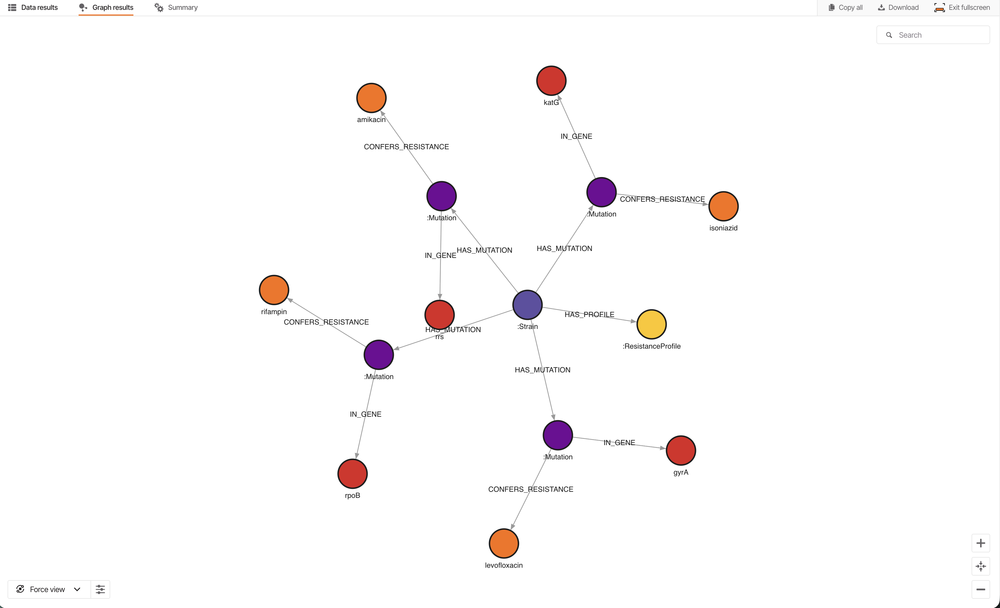

# TB Drug-Resistance Decision Support System


A hybrid decision-support prototype for Mycobacterium tuberculosis drug resistance. It combines a WHO-grounded knowledge graph, a symbolic rule 
engine, case-based reasoning over synthetic patient cases, and an LLM-driven natural-language query layer. Its symbolic core is validated against 
real-world resistance measurements from the CRyPTIC consortium.


## Objective


This system was developed as a graduate course project and serves as a portfolio piece. Its primary goal is to demonstrate how several 
methods can function together as a cohesive pipeline, a knowledge graph for evidence-based structure, a symbolic rule engine for transparent 
classification and treatment decisions, case-based reasoning to provide recommendations when rules are insufficient, and a natural-language 
interface that translates plain English into graph queries. Drug-resistant tuberculosis was deliberately chosen as the domain because it is a 
problem where each method has a distinct role, and the reasoning process needs to be transparent rather than hidden.


Choosing healthcare also meant working with imperfect data. Resistance data is often incomplete and noisy, with the two phenotype assays 
sometimes disagreeing on isolates. Additionally, open data linking genotype, treatment, and outcomes is rare. The project explicitly acknowledges 
these limitations as part of the study rather than hiding them. It reports the genotype-phenotype discordance, assay disagreements that create a 
noise floor, and missing outcome data, which necessitated a synthetic case base. The goal was to demonstrate the methods transparently and to honestly 
engage with the data's quality and constraints, rather than developing a clinical tool.


## Overview

Drug-resistant tuberculosis demands reasoning that is both auditable and grounded in current evidence. This system pairs an explicit symbolic layer, where every resistance classification can 
be traced to a WHO catalog rule, with a case-based layer that draws on prior patient experience where guidelines are silent. A natural-language interface translates plain-English questions 
into graph queries under a read-only guard, and a Streamlit front end exposes the full reasoning trace.

The project is presented as a portfolio piece rather than a deployable clinical tool. Its thesis is honest, rigorously evaluated engineering, with the synthetic patient layer and the 
genotype-phenotype prediction ceiling treated as measured limits rather than hidden ones.

A short demo video of the front end and its reasoning trace is in progress.

## Interactive demo

The Streamlit front end is the system in use. A plain-English clinical question drives the full hybrid pipeline and returns an auditable recommendation together with the reasoning behind it.



A question such as "What treatment should patient P003 receive" is answered across four tabs.

- Query Results carries the direct answer, the strain and its classification, the recommended regimen, and a table of contraindicated drugs tied to the mutations that rule them out.
- Expert System exposes the rule-engine trace, the evidence confidence, the rules that fired, and the regimen with its drug exclusions.
- Case-Based Reasoning retrieves the nearest matches from the 1,000 synthetic patient cases and reports a success rate and a confidence band.
- Technical Details shows the Cypher that the natural-language layer generated from the question, so the path from plain English to graph query stays visible.



### Running the demo

After installing the dependencies and setting the environment described under Setup, bring the system up in this order.

1. Start a local Memgraph instance in Docker and leave it running in the background. If the container already exists from an earlier run, resume it with `docker start memgraph` instead.

    ```bash
    docker run -d -p 7687:7687 -p 7444:7444 --name memgraph memgraph/memgraph-mage:3.9.0
    ```

2. Build the knowledge graph. This clears the database, applies the schema, loads the seed strains and patients, and merges the WHO catalog, then prints `Database initialized successfully`.

    ```bash
    python SRC/tb_ontology.py
    ```

3. Launch the application.

    ```bash
    streamlit run SRC/app.py
    ```

4. Paste an Anthropic API key into the sidebar, since the natural-language layer calls the Anthropic API to turn questions into Cypher.

5. Click Initialize CBR in the sidebar to load the 1,000 synthetic cases. The control reads `Active with 1000 cases` once the case base is ready.

6. Ask a question such as "What treatment should patient P003 receive" and read the result across the four tabs.

The seed strains and patients load whether or not the large datasets are present, so the demo runs on the seed graph alone. The WHO catalog merge in step 2 is skipped with a printed note when the catalog file is absent.

## Architecture

The design separates a durable, evidence-grounded platform from a swappable patient layer.

- Knowledge graph. A Memgraph store holding 1,291 mutation nodes drawn from the WHO mutation catalog. The catalog grades all 48,152 of its variants from 1 to 5, and the graph loads only the 1,383 rows graded 1 or 2, the variant–drug associations it links to resistance, since the higher groups carry uncertain or no association. Those rows collapse to 1,291 distinct mutation nodes, because a node is keyed by its mutation identifier, so a variant graded against several drugs merges into one node. Memgraph speaks the Bolt protocol, so the code reaches it through the standard neo4j Python driver, 
and the neo4j dependency in requirements.txt is that driver rather than a separate database.


- Rule engine. A forward and backward chaining symbolic engine that classifies isolates as MDR, pre-XDR, or XDR, applies whole-class cross-resistance, and selects between the BPaL and BPaLM regimens.


- Case-based reasoning. Retrieval over 1,000 synthetic patient cases, used where the rules alone do not determine a regimen.


- Natural-language interface. An LLM layer that generates Cypher from plain English behind a read-only write guard. The query runs in a read transaction that Memgraph rejects on any write, so the database itself is the barrier, and a keyword pre-filter blocks an obvious write before the query runs.

The figure below traces one strain through the graph, from its mutations to the genes and drugs they affect and on to its resistance profile, which is the same path the rule engine walks to reach a classification.



## Results

### Real-world validation of the symbolic core

The rule engine was validated on all 65,588 CRyPTIC isolates that carry a measured drug-susceptibility phenotype. It reproduces the WHO genotypic catalog on 99.8% of isolates, 
which confirms that the engine faithfully reimplements the catalog tiering it encodes rather than adding hidden logic. Measured against phenotype, the engine reaches 83.4% overall 
accuracy and the WHO catalog reaches 83.5%. The two are close but not identical. A paired McNemar test on the 105 isolates where they disagree gives $\chi^2 = 77.1$ and $p \approx 1.6 \times 10^{-18}$, and 98 of those 105 disagreements 
are engine-side, all accounted for below. The gap is small, real, and explained.

Accuracy alone flatters an imbalanced set where below-MDR is 73.3% of the isolates, so a classifier that always predicts below-MDR already reaches 73.3%. Balanced accuracy, the mean of the per-tier 
sensitivities, is 67.4% for the engine against 67.9% for the catalog, and macro-F1 is 0.662 against 0.666. Per-tier sensitivity runs from 91.6% on below-MDR to 61.9% on MDR, 61.5% on pre-XDR, and 54.7% on XDR, 
and specificity stays above 94% on every resistant tier.


The bars also frame the real result. The engine is not the bottleneck. It reaches essentially the same per-tier sensitivity as the catalog it encodes, so the headroom that remains lives in the catalog and the data, not in the implementation. The error analysis below quantifies exactly that.

The error analysis is the main finding. Of the 17,523 resistant isolates, the engine and catalog land the same way on all but 105:

| Of 17,523 resistant isolates | Isolates | Share | What it is |
| --- | ---: | ---: | --- |
| Both correct | 10,646 | 60.8% | engine and catalog both right |
| Both wrong | 6,772 | 38.6% | genotype-phenotype discordance: resistance on phenotype with no genotypic marker the catalog recognizes |
| Engine only wrong | 98 | 0.6% | 80 data-coverage gaps + 18 documented definitional cases |
| Catalog only wrong | 7 | 0.04% | — |


The 6,772 shared errors are a measured biological ceiling, not an error within the design. No genotype-based method can recover resistance that leaves no recognized genotypic marker. The 98 engine-only cases carry no logic defect either. Eighty are coverage gaps, where the catalog calls an 
isolate resistant but no graded mutation reaches the engine, so it defaults to below-MDR. The other eighteen are the documented pre-2021 definitional choice, where injectable-based escalation places an isolate one tier above the 2021 catalog: thirteen lift MDR to pre-XDR on injectable resistance, 
five lift pre-XDR to XDR on fluoroquinolone-plus-injectable resistance. The actionable error is a 0.6% sliver.


### Per-drug resistance calls

The tier validation groups measured drugs into four resistance categories. Each drug is scored individually as resistant or susceptible based on the DST phenotype, with the WHO catalog used as a reference. The engine and the catalog concur on twelve of the fifteen drugs, including both fluoroquinolones, because the catalog already combines levofloxacin and moxifloxacin under a single gyrA call. The only discrepancies occur with the three injectable drugs. In these cases, the engine considers whole-class cross-resistance, so any mutation in injectables results in flags for amikacin, kanamycin, and capreomycin together. This approach increases sensitivity slightly but reduces specificity, as injectables are only partially cross-resistant in practice. 

| Profile | Regimen accuracy | n |
| --- | ---: | ---: |
| Susceptible | 99.0% | 500 |
| MonoResistant | 55.0% | 120 |
| PolyResistant | 18.3% | 60 |
| MDR | 37.8% | 180 |
| PreXDR | 26.3% | 80 |
| XDR | 21.7% | 60 |

For example, amikacin's precision drops from 0.834 in the catalog to 0.518 in the engine, and capreomycin's from 0.776 to 0.439. This tradeoff is explicitly recorded as a property of the heuristic rather than an implicit assumption. The scoring process is executed via `python Evaluation/metrics.py`, 
which generates `per_drug_results.json`.

### Expert system

The natural-language layer is evaluated based on execution match, where each question is paired with a gold standard query. A generated query is considered correct if it returns the same entities. Since this layer relies on live model generation, 
its score depends on the specific model used rather than being a fixed attribute. On claude-sonnet-4-6, it correctly answers ten out of eleven queries and maintains this accuracy across different runs, as it generates responses at temperature zero. 
The only failure occurs in a lookup where the generator produces more information than the question requests, extracting a relationship property without binding the relationship. This causes the database to reject the query as it contains an unbound variable. 
The deterministic elements of the layer remain stable. A read-only write guard and query routing are fixed by the test suite. Additionally, normalization removes an order clause the database cannot handle after an aggregate, making the remaining issue a generation mistake rather than a flaw in the layer.

### Case-based reasoning, the experimental component

Regimen accuracy is 67.4% against an 81.0% majority-class baseline, and outcome accuracy is 74.5% against a 73.8% baseline. The regimen shortfall decomposes into roughly 7.5 points of objective mismatch and 6 points of retrieval starvation in the rare resistant classes, where neighbor-based retrieval is data-poor by construction. This result is reported as the measured behavior of the experimental layer, not as the headline.

The synthetic cohort is a deliberate response to a structural data gap. A case-based regimen recommender needs records that link a genotype, a patient profile, the regimen given, and the outcome observed, and no open dataset carries that full chain at the scale required. Treatment-outcome data of this kind is scarce, fragmented across institutions, and tightly held for privacy reasons, which is a well-documented obstacle in clinical machine learning rather than a quirk of this project. Generating the cases keeps the retrieval layer transparent and reproducible while that gap stands.

The weaker numbers in the rare resistant classes follow from the same scarcity. XDR and pre-XDR are uncommon by definition, so even a large cohort holds few neighbors for them, and neighbor-based retrieval degrades wherever a class is thin. The shortfall is therefore a measured consequence of insufficient data per class rather than a defect in the retrieval method, and it mirrors what learned models face on the same rare-disease data.

### Calibration

Expected calibration error is 0.075 on the raw predicted success probability, and the Brier score is 0.192. Post-hoc temperature scaling was tested and rejected on evidence, since it raised the calibration error to 0.177, a classic mismatch between negative log-likelihood and calibration error.

## Data

The platform is grounded in the WHO mutation catalog, second edition, supplied as the data file WHO-UCN-TB-2023.7-eng.xlsx. Real-world validation draws on the CRyPTIC consortium release, which provides whole-genome variants graded against the catalog together with measured drug-susceptibility phenotypes. All 65,588 isolates with a measured phenotype form the validation set, scored in full rather than on a held-out split. The two phenotype assays in the release, DST and UKMYC, agree on 95.6% of jointly measured isolates, 
which sets a label-noise floor beneath the accuracy figures above. The synthetic patient cases are transparent and deterministic given a fixed seed.

The real datasets are not stored in this repository because of their size. To reproduce the results, download them into a `Datasets/` folder at the project root. The catalog file WHO-UCN-TB-2023.7-eng.xlsx comes from the World Health Organization. The CRyPTIC tables EFFECTS.parquet, PREDICTIONS.parquet, DST_MEASUREMENTS.parquet, UKMYC_PHENOTYPES.parquet, and DRUG_CODES.csv come from the CRyPTIC consortium release on Zenodo. 
The synthetic patient cases are produced in code and need no download. Reading the CRyPTIC parquet tables needs the pyarrow engine, which `requirements.txt` installs.

## Evaluation

All scoring runs through a single entry point.

```bash
python Evaluation/validation.py
```

This runs the expert-system and case-based-reasoning validation against the live graph, skipping that arm with a printed note if the database or API is unavailable, and then runs the database-free CRyPTIC classification validation. Results are written to `validation_results.json`.

The per-drug resistance scoring runs on its own and writes `per_drug_results.json`.

```bash
python Evaluation/metrics.py
```

The shared scoring functions, sensitivity, specificity, precision, balanced accuracy, macro-F1, the McNemar test, and the Brier score, live in `Evaluation/metrics.py`, so the tier scoring in `validation.py` and the per-drug scoring use one definition and stay comparable.

A separate deterministic test suite of 44 tests locks in rule-engine classification, calibration math, the read-only query guard and routing, generator determinism, and seed-graph integrity. It needs no database, API, or datasets, and runs from the project root.

```bash
pytest Evaluation/test_core.py
```

The same suite runs in continuous integration on every push, across Python 3.10, 3.11, and 3.12.

## Limitations

- The patient layer is synthetic because no open dataset links genotype, regimen, and outcome at the scale a case-based recommender needs. This data scarcity is a well-known challenge in healthcare machine learning, and it is the direct reason the rare resistant classes evaluate poorly.


- The case-based similarity weights are domain-informed priors set by hand, not values learned from data, and tuning them is future work. The region and outcome tables in the case generator follow the same pattern, since they carry real structure from the WHO regions while their magnitudes stay synthetic rather than transcribed from any WHO release.


- The regimen layer is scored by exact match to the labeled regimen, which penalizes it for optimizing treatment outcome instead, so part of the measured shortfall is a metric mismatch rather than a modeling error.


- CRyPTIC provides genotype and phenotype but not treatment outcomes, so it validates classification only and cannot validate the regimen and outcome layer.


- The rule engine implements a scoped pre-2021 XDR definition, documented as a deliberate choice rather than the current Group A based standard.


- The rule engine does not model ethionamide, so the inhA cross-resistance that links isoniazid and ethionamide is out of scope. This is a named boundary rather than an oversight.


- Genotype-based resistance prediction is bounded by discordance. Of the 17,523 resistant isolates, 6,772 carry phenotypic resistance with no genotypic marker the catalog recognizes, so that share is not recoverable from the catalog by any rule-based method.

## Future work

- Outcome validation of the case-based layer against the TB Portals dataset, which carries real treatment outcomes, to replace the synthetic cohort where the evaluation most needs real signal. Real data raises the credibility of the result rather than guaranteeing a higher one, since rare resistant cases stay scarce even in the largest real cohorts.


- A learned model trained on the full genome-wide variant table and minimum-inhibitory-concentration magnitudes, to probe how much of the genotype-phenotype discordance ceiling can be recovered beyond the curated catalog.


- Scoring the regimen layer on the objective it optimizes, treatment outcome and guideline-conformant choice, rather than exact match to the labeled regimen. This is the most tractable item here, since it needs no new data and removes the metric-mismatch portion of the shortfall directly.


- Confidence-gated deferral, where a sparse retrieval neighborhood abstains to the rule engine and coverage is reported alongside accuracy, turning rare-class data scarcity into a calibrated behavior.


- Gene-aware injectable cross-resistance. The current whole-class rule flags amikacin, kanamycin, and capreomycin together, which the per-drug table shows over-calls amikacin and capreomycin against measured DST. Keying cross-resistance on the gene, with rrs conferring broad resistance and eis leaning toward kanamycin, would recover the lost precision without changing the tier results.

## Setup

Install the dependencies, then set the environment.

```bash
pip install -r requirements.txt
```

The natural-language interface calls the Anthropic API, so set `ANTHROPIC_API_KEY` in your environment or in a local `.env` file. Graph credentials are read from the environment as well, through `NEO4J_URI`, `NEO4J_USER`, and `NEO4J_PASSWORD`, and default to a local no-auth instance at `bolt://localhost:7687`. The `.env.example` file lists the variables to set.

The steps under Running the demo bring up the graph and the app. For the full local runbook, including dataset placement and troubleshooting, see [DEPLOYME.md](DEPLOYME.md).

## References

### Case-Based Reasoning

1. Kolodner, J. L. (1992). An Introduction to Case-Based Reasoning. *Artificial Intelligence Review*, 6(1), 3–34.
2. Main, J., Dillon, T. S., & Shiu, S. C. K. (2001). A Tutorial on Case-Based Reasoning. *Soft Computing in Case Based Reasoning*, 1–28.
3. Goel, A. K., & Díaz-Agudo, B. (2017). What's Hot in Case-Based Reasoning. *Proceedings of AAAI-17*.
4. Das, R., Godbole, A., Dhuliawala, S., Zaheer, M., & McCallum, A. (2020). A Simple Approach to Case-Based Reasoning in Knowledge Bases. *Automated Knowledge Base Construction (AKBC)*.

### WHO Guidelines

5. World Health Organization. (2023). *Catalogue of mutations in Mycobacterium tuberculosis complex and their association with drug resistance* (2nd ed.).
6. World Health Organization. (2025). *WHO consolidated guidelines on tuberculosis: Module 4: Treatment and care*.
7. Walker, T. M., et al. (2022). The 2021 WHO catalogue of Mycobacterium tuberculosis complex mutations. *The Lancet Microbe*, 3(4), e265–e273.

### Calibration

8. Guo, C., Pleiss, G., Sun, Y., & Weinberger, K. Q. (2017). On Calibration of Modern
   Neural Networks. *Proceedings of the 34th International Conference on Machine Learning
   (ICML)*, PMLR 70, 1321–1330.

### Treatment Evidence

9. Nyang'wa, B.-T., et al. (2022). A 24-Week, All-Oral Regimen for Rifampin-Resistant
   Tuberculosis. *New England Journal of Medicine*, 387(25), 2331–2343. (TB-PRACTECAL; BPaLM)
10. Conradie, F., et al. (2020). Treatment of Highly Drug-Resistant Pulmonary Tuberculosis.
    *New England Journal of Medicine*, 382(10), 893–902. (Nix-TB; BPaL)

### Datasets

11. The CRyPTIC Consortium. (2022). A data compendium associating the genomes of 12,289
    *Mycobacterium tuberculosis* isolates with quantitative resistance phenotypes to 13
    antibiotics. *PLOS Biology*, 20(8), e3001721.
12. Rosenthal, A., et al. (2017). The TB Portals: an Open-Access, Web-Based Platform for
    Global Drug-Resistant-Tuberculosis Data Sharing and Analysis. *Journal of Clinical
    Microbiology*, 55(11). doi:10.1128/JCM.01013-17.

## License

Released under the MIT License.