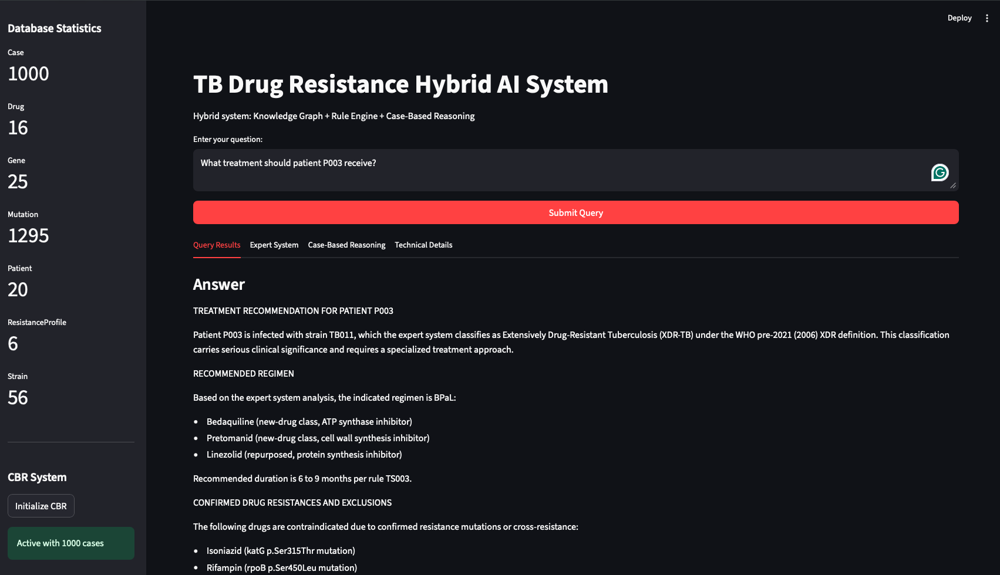
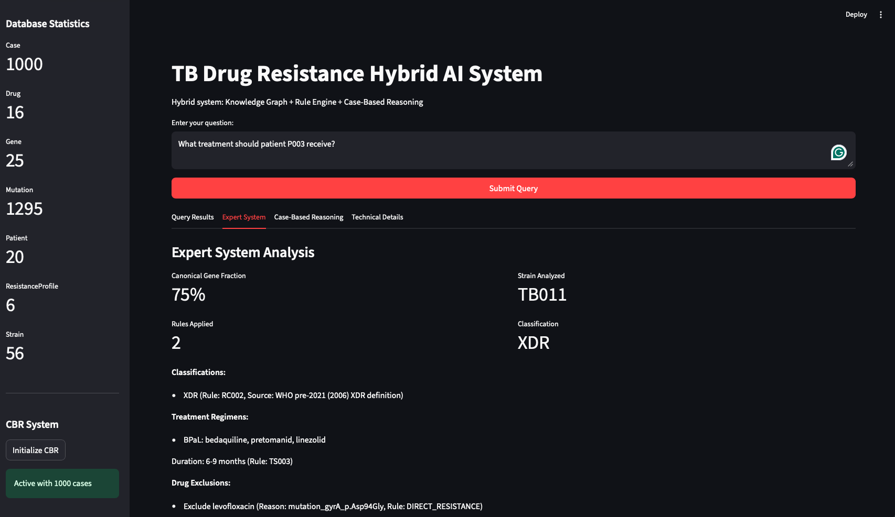
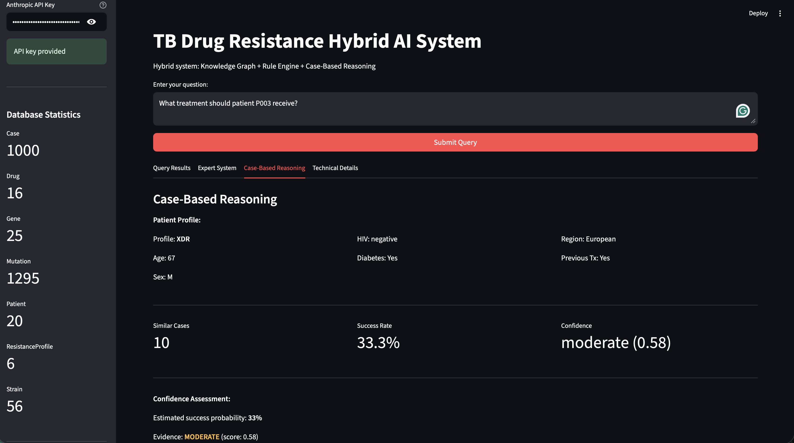
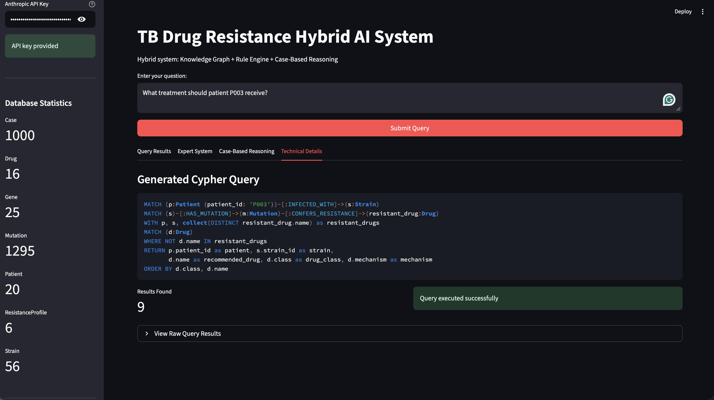
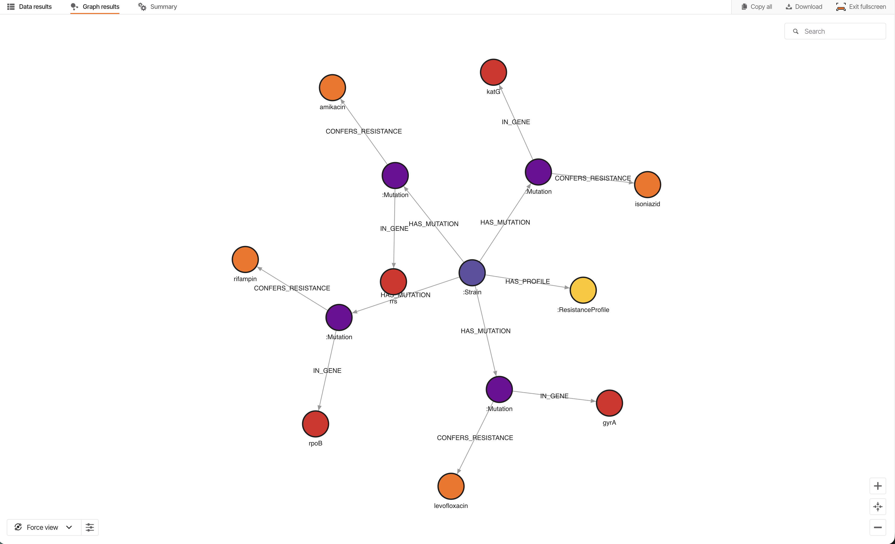

# TB Drug-Resistance Decision Support System

[](https://github.com/jsf3467v/tb-drug-resistance/actions/workflows/tests.yml)
[](https://github.com/jsf3467v/tb-drug-resistance/actions/workflows/ci.yml)


A hybrid decision-support prototype for *Mycobacterium tuberculosis* drug resistance. It combines a knowledge graph grounded in the World Health Organization (WHO) mutation catalog, a symbolic rule engine, case-based reasoning over synthetic patient cases, and a natural-language query layer driven by a large language model. The rule engine is validated against real-world resistance measurements from the Comprehensive Resistance Prediction for Tuberculosis international consortium, known as CRyPTIC.

## Objective

This system was developed as a graduate course project and serves as a portfolio piece. Its goal is to show how several methods work together as one pipeline. The knowledge graph supplies evidence-based structure, the rule engine produces transparent classifications and treatment decisions, case-based reasoning addresses what the rules cannot settle, and a natural-language layer translates questions into graph queries.

Drug-resistant tuberculosis was chosen because the domain supplies what each of these methods needs. WHO publishes a graded mutation catalog and written resistance definitions, so the knowledge graph and the rule engine encode published evidence rather than structure invented for the exercise. Treatment selection is guideline-driven but stays underdetermined once an isolate resists part of the recommended regimen, which is the gap the case-based layer fills.

Healthcare was selected for its difficulties rather than despite them. The field requires systems to handle conflicting labels, incomplete outcomes, and evidence graded by confidence rather than by certainty, conditions that clean benchmarks rarely present. Three constraints follow from that choice and shape every result below. The patient cases are synthetic, the rule engine reaches only isolates carrying a graded mutation, and the regimen layer is scored against a labeled regimen rather than against outcome. Each is measured and reported beside the figure it bounds, and Limitations gives the full account.

## Overview

Drug-resistant tuberculosis requires reasoning that is both auditable and grounded in current evidence. Each classification here is linked to a named rule and each mutation reference to a catalog entry. The case-based layer decides the regimen where rules alone are insufficient. A natural-language interface converts questions into graph queries under a read-only restriction, and a Streamlit front end shows the reasoning.

An isolate is classified into four tiers. Below-MDR covers anything short of resistance to both first-line drugs. Multidrug-resistant, abbreviated MDR, means resistance to isoniazid and rifampin. Pre-extensively drug-resistant, abbreviated pre-XDR, adds one further drug class, and extensively drug-resistant, abbreviated XDR, adds two.

## Interactive demo

A clinical question drives the whole pipeline and returns an auditable recommendation.



A question such as "What treatment should patient P003 receive" is answered across four tabs. Query Results carries the direct answer, the strain and its classification, the recommended regimen, and the contraindicated drugs tied to the mutations that rule them out. Expert System exposes the rule-engine trace. Case-Based Reasoning retrieves the nearest matches from the 1,000 synthetic cases and reports a success rate with a confidence band. Technical Details shows the generated Cypher, so the path from text to graph query stays visible.



Strain TB011 classifies as XDR under rule RC002, and rule TS003 then selects BPaL. Five rules apply rather than six, because a treatment question runs backward chaining, which proves the XDR goal without visiting the pre-XDR rule.



The Case-Based Reasoning tab answers the same question from prior cases rather than from rules. Ten neighbors match and three succeeded. The reported 33.3 percent rather than the raw 30 percent is Laplace smoothing, which Calibration describes. Confidence reads moderate because the neighbors disagree on outcome.



### Running the demo

Full setup is in [DEPLOYME.md](DEPLOYME.md). Once dependencies and the environment are in place, three commands suffice.

```bash
docker run -d -p 7687:7687 -p 7444:7444 --name memgraph memgraph/memgraph-mage:3.9.0
python SRC/tb_ontology.py
streamlit run SRC/app.py
```

Paste an Anthropic API key into the sidebar, click Initialize CBR to load the 1,000 synthetic cases, then ask a question. The seed strains and patients load whether or not the large datasets are present, so the demo runs on the seed graph alone.

## Architecture

The design separates a durable, evidence-based platform from a swappable patient layer.

- Knowledge graph. A Memgraph database holds 1,295 mutation nodes. The WHO catalog grades 48,152 variant and drug pairs on a scale from 1 to 5 across 30,699 unique variants, and the graph loads only the 1,383 pairs graded 1 or 2, since higher grades indicate uncertain or absent association. Those pairs consolidate into 1,291 nodes, because a node is keyed on the mutation and a variant linked to several drugs merges into one. The remaining four are seed mutations the catalog does not grade, the other 19 of the 23 seed mutations having merged into catalog entries. Memgraph speaks the Bolt protocol, so the neo4j dependency in `requirements.txt` is that driver rather than a second database.

- Rule engine. A symbolic engine using forward and backward chaining classifies isolates as MDR, pre-XDR, or XDR, applies whole-class cross-resistance, and chooses between the BPaL and BPaLM regimens. The two modes agree on classifications, exclusions, and alerts across every resistance flag combination the suite tests, and on regimens, inclusions, and monitoring whenever a treatment question is asked. A classification question stops at the tier, so everything downstream is withheld rather than computed. Only the list of rules fired can differ, since forward chaining reaches the pre-XDR rule on an XDR isolate while backward chaining stops earlier.

- Case-based reasoning. Retrieval over 1,000 synthetic patient cases returning a regimen, a success rate, and a confidence band from the nearest neighbors, using seven hand-set similarity weights rather than learned ones.

- Natural-language interface. An Anthropic model converts plain English into Cypher. The query runs in a read transaction that Memgraph rejects on any write, which makes the database the primary barrier, and a keyword pre-filter catches obvious write attempts before execution.

The figure below follows one strain from its mutations to the genes and drugs they affect and on to its resistance profile. The rule engine reads mutation-to-drug associations from this structure directly rather than traversing it, so the figure shows the source of its facts rather than a path taken.



## Results

Every figure below is written to `Evaluation/validation_results.json` by the commands in [DEPLOYME.md](DEPLOYME.md) section 6. Full per-tier and per-drug scoring sits in [EVALUATION.md](EVALUATION.md).

| Arm | Measure | Score | Floor | Ceiling |
| --- | --- | ---: | ---: | ---: |
| Tier classification | accuracy against phenotype | 83.4% | 73.3% majority | 83.5% catalog |
| Tier classification | balanced accuracy | 67.4% | 25.0% | 67.9% catalog |
| Regimen retrieval | exact match | 77.2% | 79.3% majority | 79.8% |
| Outcome probability | area under the curve | 0.562 | 0.500 | 0.668 |
| Query translation | execution match | 90.9% | | |

Two rows carry a measured ceiling rather than a perfect one, and the pair is the most useful thing in the table. The regimen ceiling of 79.8 percent sits half a point above the majority baseline and 2.6 points above the score, so that layer is bounded by the synthetic cohort. The outcome ceiling of 0.668 sits far above its score, so that layer is bounded by the neighborhood weighting instead. One calculation separates them, and [EVALUATION.md](EVALUATION.md) sets out both.

Three limits shape every number above.

Sensitivity is capped at 79.7 percent, because 3,562 of the 17,523 isolates measured at MDR or higher never reach a rule. Of those, 3,182 carry no genotype at all and only 380 were sequenced and carry nothing the catalog grades. On the 53,735 isolates the release does sequence, the ceiling rises to 97.3 percent and balanced accuracy from 67.4 to 78.8 percent, reported under `sensitivity_ceiling` and `genotype_covered`. The spread across tiers has the same cause, since one pooled collection sequenced its XDR isolates far less completely than its MDR ones.

Precision on the top two tiers is held down because only 59.0 percent of the cohort was tested for both a fluoroquinolone and an injectable, and the label reads an untested drug as susceptible.

The regimen layer is scored by exact match to a labeled regimen, which penalizes it for optimizing treatment outcome instead.


## Data

The platform is built on the [WHO mutation catalog, second edition](https://www.who.int/publications/i/item/9789240082410). Real-world validation uses [CRyPTIC release 3.4.0](https://doi.org/10.5281/zenodo.15680920), which pairs whole-genome variants graded against that catalog with laboratory resistance phenotypes. Download instructions are in [DEPLOYME.md](DEPLOYME.md) section 4.

The validation set is the 65,588 samples carrying a usable drug-susceptibility result, scored in full rather than on a held-out subset. Of those, 53,735 also carry a genotype and 11,853 do not. The second group matters, because an isolate with no genotype reaches no rule and scores below-MDR for want of input, which is why Results reports both readings.

The release carries two phenotype sources. Drug susceptibility testing, abbreviated DST, is the reference method run in clinical laboratories, and the UKMYC plate is a broth microdilution assay read across a fixed drug panel. The two agree on 94.8 percent of the 21,568 isolates measured by both, which sets a label-noise floor beneath every accuracy figure above. They disagree on 1,117 isolates, and on all 1,117 the UKMYC profile is the less severe of the two, never the more severe. The exploratory analysis separates how much of that follows from the narrower UKMYC panel.

The catalog does not classify every call as resistant or susceptible. Some are uncertain and some failed, and both arms count these as not resistant, matching the treatment of isolates with no genotypic call. The exposure is worth naming. Across the release, 31,517 isolates carry at least one uncertain call and 4,957 at least one failed call, giving 33,782 with either. On rifampin and isoniazid, the two drugs that define MDR, the counts are 2,927 uncertain, 712 failed, and 3,630 with either. Reading uncertain calls as resistant would move every figure in both arms.

The synthetic patient cases are generated in code and are deterministic under a fixed seed.

## Evaluation

Scoring runs through two entry points, both detailed in [DEPLOYME.md](DEPLOYME.md) section 6.

```bash
python Evaluation/validation.py   # tier, expert-system, and case-based arms
python Evaluation/metrics.py      # per-drug scoring
pytest tests/test_core.py         # 125 tests, no database, API, or datasets
```

Every scoring primitive comes from `Evaluation/metrics.py`, so the tier arm and the per-drug arm measure the same quantities. The reference arm differs between them. The tier arm reads the catalog profile from `PREDICTIONS.parquet` and the per-drug arm reads it from `EFFECTS.parquet`, so both of its columns come from one table. Compare within an arm rather than across the two files.

The CRyPTIC, per-drug, and case-based arms are deterministic under a fixed seed of 42, and repeated runs reproduce every digit in the two result files, apart from the last decimal place of one p-value on some hardware, which moves with floating-point summation order. The expert-system arm calls a live model and is the one figure expected to change, so it is reported beside the model that generated it. Seven runs returned ten of eleven four times and eleven of eleven three times.

The project builds up in three levels. The test suite needs only `pip install -r requirements-dev.txt`. Adding Docker and an Anthropic API key activates the demo and the expert-system arm on the seed graph, with no datasets downloaded. Adding the `Datasets/` folder unlocks the CRyPTIC and per-drug arms.

### Exploratory analysis

[EDA/EDA.ipynb](EDA/EDA.ipynb) documents the data work behind the design, including the label-noise floor, the baselines the case-based layer must beat, the coverage gap between the PREDICTIONS and EFFECTS tables, and the seed graph composition. It shares `baseline_accuracy` with `validation.py`, so the baselines shown there and the ones the system is scored against are one function rather than two similar ones.

## Limitations

- The patient layer is synthetic because no open dataset links genotype, regimen, and outcome at the scale a case-based recommender needs. This scarcity is a known difficulty in healthcare machine learning, and it is the direct reason the rare resistant classes evaluate poorly.

- The case-based similarity weights are domain-informed priors set by hand rather than values learned from data, and tuning them is future work. The region and outcome tables in the case generator follow the same pattern, carrying real structure from the WHO regions while their magnitudes stay synthetic.

- The regimen layer is scored by exact match to the labeled regimen, which penalizes it for optimizing treatment outcome instead, so part of the measured shortfall is a metric mismatch rather than a modeling error. CRyPTIC supplies genotype and phenotype but no treatment outcomes, so it validates classification only and cannot validate this layer at all.

- Classification follows the pre-2021 definitions rather than the current standard, and that one choice explains three things that would otherwise look like separate faults. XDR and pre-XDR are anchored to injectable resistance rather than to the Group A drugs. MDR is anchored to isoniazid and rifampin together, where the current definition also admits rifampin resistance alone. An injectable-resistant isolate is therefore labeled pre-XDR while still being routed to BPaLM by the WHO 2022 regimen rules, a pairing the current definition would not produce. The choice is deliberate. The release does carry bedaquiline and linezolid phenotypes, but on few isolates and at genotypic sensitivity of 0.40 and 0.23, the weakest of the four drugs the current definition reads, below levofloxacin at 0.66 and moxifloxacin at 0.70. The reference label reads the same anchor through `feature_engineering.profile()`, so both sides of every comparison use one definition, and the effect at the MDR boundary is conservative, since a rifampin-monoresistant isolate is placed below MDR rather than above it.

- A regimen is a guideline recommendation, not a per-patient prescription. Where an isolate resists a component drug, the engine keeps the regimen and names the drug in a contraindicated field rather than substituting, since choosing the replacement is a clinical decision the rule base does not model.

- The mono and poly split is performed by the labeling pipeline rather than the rule engine, and it counts every resistant drug rather than the first-line set alone. This matches the terminology used by the Centers for Disease Control and Prevention and extends to second-line agents as WHO anticipated for surveillance. The WHO definition itself is restricted to first-line drugs, so this is a stated deviation. It alters no classification at MDR or above, which the test suite holds structurally.

- Precision is limited by phenotype coverage. The label reads an untested drug as susceptible, and only 59.0 percent of the cohort has both a fluoroquinolone and an injectable result, so a correct genotypic call above MDR can be scored a false positive on an isolate that was never measured. Among the measured isolates, pre-XDR precision improves from 0.483 to 0.616 and XDR from 0.482 to 0.629. XDR sensitivity holds at 54.7 percent, since no isolate can be labeled XDR without a result for both classes, and pre-XDR sensitivity moves only from 61.5 to 61.9 percent. Both readings are reported under `second_line_covered`.

- Sensitivity is bounded by input coverage. Of the 17,523 isolates measured at MDR or above, 3,562 carry no graded mutation and no rule can reach them, so every sensitivity figure should be read against the ceiling reported beside it rather than against 100 percent.

- Cross-resistance within the injectable class is modeled as a whole, and the per-drug scoring shows it costs more precision than it gains in sensitivity. The behavior is reported rather than corrected. Narrowing it would not change any tier, because the class rule writes only into the exclusion list and never into the facts the classifier reads, but it would shift every value in the per-drug section, so it is a rescoring rather than a patch. See Future work.

- The rule engine does not model ethionamide, so the cross-resistance linking isoniazid and ethionamide through the enoyl reductase gene, written inhA, is out of scope. This is a named boundary rather than an oversight.

## Future work

The directions fall into two groups, the data the system can reach and the way its layers are scored.

The largest data gap is the synthetic case base. Validating the case-based layer against the TB Portals dataset, which carries real treatment outcomes, would replace the cohort where real signal is most needed. Real data would strengthen the result without necessarily raising accuracy, since resistant cases stay rare even in large collections. Separately, training a model on the full genome-wide variant table and the minimum inhibitory concentration magnitudes would test how much of the genotype-phenotype mismatch can be explained beyond the curated catalog.

On scoring, the simplest change is to score the regimen layer against outcome directly, which needs no additional data and fixes the metric mismatch at its source. The outcome layer now carries a measured ceiling, and the gap beneath it is wide enough to make the similarity weights the first thing to tune, scored against that ceiling rather than against a perfect one. Confidence-gated deferral would extend the abstention the engine already performs when its neighbors carry nothing applicable. A sparse neighborhood would hand the case to the rule engine, and the arm would report coverage beside accuracy, which turns rare-class scarcity into calibrated behavior rather than silent error.

The whole-class injectable rule groups amikacin, kanamycin, and capreomycin together, and the per-drug scoring shows it over-calls all three against measured phenotype. The cost falls almost entirely on two of them. Amikacin and capreomycin lose 31.7 and 33.7 points of precision for sensitivity gains of 2.2 and 4.2, while kanamycin loses 3.9 for a gain of 0.2. That asymmetry is what the expansion would produce if kanamycin, the most frequently resistant of the three, is mainly the source of the added calls rather than their recipient. Tying cross-resistance to the gene instead, with rrs conferring resistance across the class and eis favoring kanamycin, would recover precision without moving any tier.

## References

### Case-Based Reasoning

1. Kolodner, J. L. (1992). An Introduction to Case-Based Reasoning. *Artificial Intelligence Review*, 6(1), 3-34.
2. Main, J., Dillon, T. S., & Shiu, S. C. K. (2001). A Tutorial on Case-Based Reasoning. *Soft Computing in Case Based Reasoning*, 1-28.
3. Goel, A. K., & Díaz-Agudo, B. (2017). What's Hot in Case-Based Reasoning. *Proceedings of AAAI-17*.
4. Das, R., Godbole, A., Dhuliawala, S., Zaheer, M., & McCallum, A. (2020). A Simple Approach to Case-Based Reasoning in Knowledge Bases. *Automated Knowledge Base Construction (AKBC)*.

### WHO Guidelines

5. World Health Organization. (2023). *Catalogue of mutations in Mycobacterium tuberculosis complex and their association with drug resistance* (2nd ed.).
6. World Health Organization. (2022). *WHO consolidated guidelines on tuberculosis. Module 4, drug-resistant tuberculosis treatment, 2022 update*. (the source the treatment rules cite)
7. World Health Organization. (2025). *WHO consolidated guidelines on tuberculosis. Module 4, treatment and care*.
8. Walker, T. M., et al. (2022). The 2021 WHO catalogue of Mycobacterium tuberculosis complex mutations. *The Lancet Microbe*, 3(4), e265-e273.

### Calibration

9. Guo, C., Pleiss, G., Sun, Y., & Weinberger, K. Q. (2017). On Calibration of Modern Neural Networks. *Proceedings of the 34th International Conference on Machine Learning (ICML)*, PMLR 70, 1321-1330.

### Treatment Evidence

10. Nyang'wa, B.-T., et al. (2022). A 24-Week, All-Oral Regimen for Rifampin-Resistant Tuberculosis. *New England Journal of Medicine*, 387(25), 2331-2343. (TB-PRACTECAL; BPaLM)
11. Conradie, F., et al. (2020). Treatment of Highly Drug-Resistant Pulmonary Tuberculosis. *New England Journal of Medicine*, 382(10), 893-902. (Nix-TB; BPaL)

### Datasets

12. The CRyPTIC Consortium. (2025). *CRyPTIC data release 3.4.0* [Data set]. Zenodo. doi:10.5281/zenodo.15680920. (the release the reported figures are computed on)
13. The CRyPTIC Consortium. (2022). A data compendium associating the genomes of 12,289 *Mycobacterium tuberculosis* isolates with quantitative resistance phenotypes to 13 antibiotics. *PLOS Biology*, 20(8), e3001721.
14. Rosenthal, A., et al. (2017). The TB Portals, an Open-Access, Web-Based Platform for Global Drug-Resistant-Tuberculosis Data Sharing and Analysis. *Journal of Clinical Microbiology*, 55(11). doi:10.1128/JCM.01013-17.

## License

Released under the MIT License.
